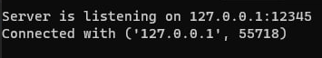
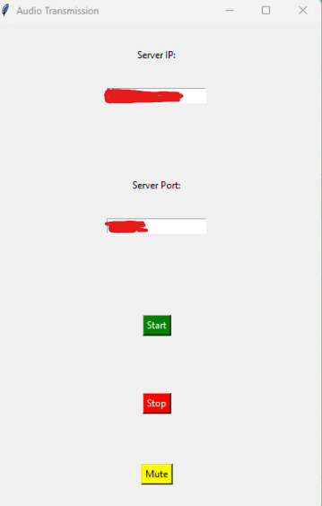

# Voice Chat

# Table of contents
1. [Screenshots](#Screenshots)
2. [Tech Stack](#Stack)
3. [Features](#features)
4. [Run Locally](#run)
5. [Feedback](#Feedback)
6. [License](#License)

## Screenshots

### Server:

### Client map:

## Tech Stack

**Client:** Python, Socket

**Server:** Python, Socket

## Features

- Connect to server
- Disconnect to server
- Button 'mute'

## Run Locally

Clone the project

~~~bash
git clone https://github.com/ka9mal6t/voice-chat.git
~~~

Go to the project directory

~~~bash
cd voice-chat
~~~

Install dependencies

~~~bash
pip install -r requirements.txt
~~~

Start the server

~~~bash
python server.py
python client.py
~~~

## Feedback

If you have any feedback, please reach out to us at vladimyr.kilko@gmail.com

## License

[MIT](LICENSE)

